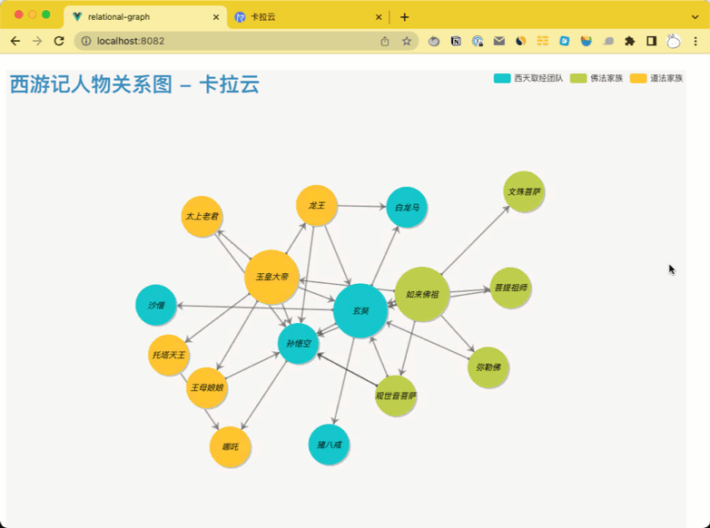

# Echarts 西游记人物关系图示例代码

本教程配套文章请访问卡拉云技术博客：《[Echarts 关系图完全配置指南](https://kalacloud.com/blog/echarts-graph-tutorial)》


DEMO 演示地址：https://my.kalacloud.com/apps/a8f99u5q78/published



## Project setup
```
npm install
```

### Compiles and hot-reloads for development
```
npm run serve
```

### Compiles and minifies for production
```
npm run build
```

### Lints and fixes files
```
npm run lint
```

### Customize configuration
See [Configuration Reference](https://cli.vuejs.org/config/).
